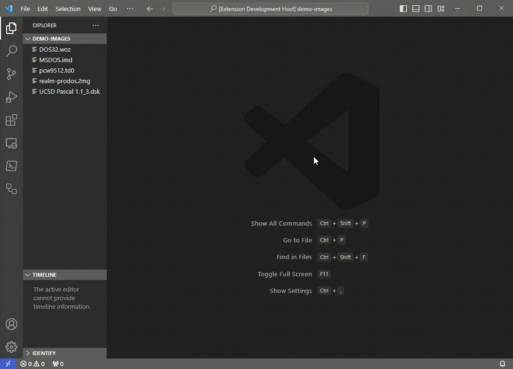

# Disk Image Notebook

Click on a disk image in your project tree to see the root directory in the file system's native style.  Dig deeper using either the interactive mode or by entering commands in code cells.  For the present, this is designed to never modify any disk image.

## Demo

The interface has evolved compared to what is shown, but basic ideas remain the same.

note: install appropriate language extensions to gain highlights, diagnostics, etc., upon opening a file in the editor.  Often the file must be saved before analysis becomes available.

## Platform Support

The backend is bundled for Windows x86_64, Linux x86_64, Mac x86_64, and Mac aarch64.  If you have something else the extension will try to fallback to the user's cargo installation.  To install the backend with cargo do the following:

1. Install a C compiler if necessary
2. Install rust if necessary, often a package manager suffices, e.g. `brew install rust`, otherwise search for `rustup`
3. Enter `cargo install a2kit` in your terminal

## Proprietary Formats

You can sometimes unlock a protected file system as follows.

1. Extract the baseline soft sector format using `ssfmt` in a code cell
2. Copy the output of `ssfmt` and paste it into a new code cell
3. Edit the format and run that code cell, then try decoding a sector, either using another code cell, or by re-running interactive
4. Iterate if necessary

This only works on WOZ or NIB images, as of this writing.

## Note on ANIMALS

The demo shows the source code for `ANIMALS`.  There is sometimes no space after the `REM` token.  This is not a mistake.  The backend's detokenizers are designed to be inversions of the vendor's tokenizers.  In some cases the vendor's detokenizer is *not* an inversion, in which case the backend's detokenizer will format things differently.